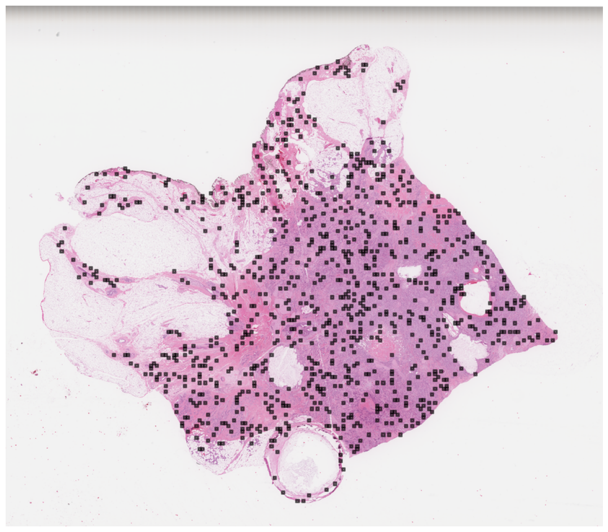
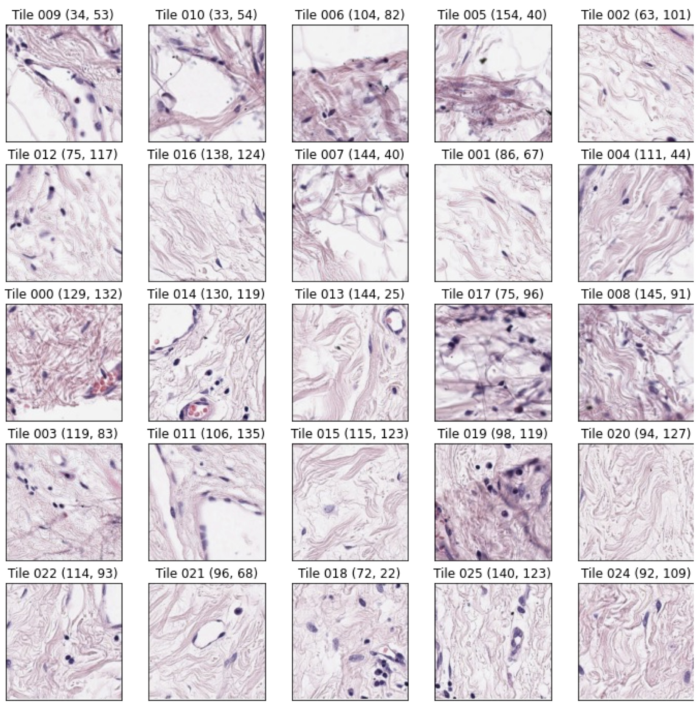

# ENS Data Challenge 2023 - Detecting PIK3CA mutation in breast cancer by OWKIN 
Link: https://challengedata.ens.fr/participants/challenges/98/

Authors: Arianna Morè, João Melo, Maria Stoelben

## Challenge context
🔬 Histopathology
Histopathology is the study of the microscopic structure of diseased human tissue. Analysis of histopathology slides is a critical step for many diagnoses, specifically in oncology where it defines the gold standard. Tissue samples are usually collected during surgery or biopsy. After being preprocessed by expert technicians, pathologists review samples under a microscope in order to assess several biomarkers such as the nature of the tumor, cancer staging etc.

🧬 PIK3CA mutation in breast cancer
Recent studies have also shown that histopathology slides contain information that underlie tumor genotype, therefore they can be used to predict genomic alterations such as point mutations. One of the genomic alterations that is particularly interesting is PIK3CA mutation in breast cancer. They occur in around 30%-40% of breast cancer and are most commonly found in estrogen receptor-positive breast cancer. PIK3CA mutations have been associated with good outcomes. More importantly, patients who carry these mutations and are resistant to endocrine therapy may respond to a class of target therapy - the PI3Kα inhibitor.

🔍 Challenge's purpose
Current method for identifying PIK3CA mutations is DNA sequencing, which requires technical and bioinformatic expertise that is not accessible in all laboratories. An automated solution to detect PIK3CA mutation has high clinical relevance as it could provide a fast, reliable screening tool allowing more patients, especially in tertiary centers, to be eligible to personalized therapies associated to better outcomes.

## Challenge context
The challenge proposed by Owkin is a weakly-supervised binary classification problem. Weak supervision is crucial in digital pathology due to the extremely large dimensions of whole-slide images (WSIs), which cannot be processed as is. To use standard machine learning algorithms one needs, for each slide, to extract smaller images (called tiles) of size 224x224 pixels (approx 112 µm²). Since a slide is given a single binary annotation (presence or absence of mutation) and is mapped to a bag of tiles, one must learn a function that maps multiple items to a single global label. This framework is known as multiple-instance learning (MIL). More precisely, if one of the pooled tiles exhibits a mutation pattern, presence of mutation is predicted while if none of the tiles exhibit the pattern, absence of mutation is predicted. This approach alleviates the burden of obtaining locally annotated tiles, which can be costly or impractical for pathologists.

In this challenge, we aim to predict whether a patient has a mutation of the gene PIK3CA, directly from a slide. For computational purposes, we kept a total of 1,000 tiles per WSI. Each tile was selected such that there is tissue in it.

Here we display an example of whole slide image with 1,000 tiles highlighted in black.

*Figure 1: Example of a whole slide image with the 1,000 tiles selected during preprocessing highlighted in black*

Some of those tiles are displayed below. The coordinates are indicated in parenthesis for each tile.

*Figure 2: Example of 224x224 pixels tiles extracted at a 20x magnification with their (x, y)-coordinates*

## Data description
### Labels
At the tissue sample scale, our problem is a supervised one as we have mutation data over the whole training set. Labels for the train dataset are in *train_output.csv​ (0=​wildtype and 1=mutated​)*. At the tile scale, the problem is a weakly supervised one as we have one label per bag of tiles.

### Inputs
For each patient, we provided three types of input:
- the set of (maximum 1,000) tile images randomly chosen inside the tissue as .jpg files
- the feature vectors extracted from each of the tiles using a pre-trained resnet model
- metadata related to the original slide image.

### Images
In the image folder (images) is stored one folder per sample, named sample_id containing RGB images of size 224x224x3 (i.e. 3D matrices) stored as *.jpg* files. Each folder contains (up to) 1,000 tiles. The whole-slide images used in this challenge originally come from the TCGA-BRCA dataset.

### MoCo v2 features
In the feature folder (moco_features) is stored one matrix per sample named [sample_id].npy. This matrix is of size Nₜ x 2,051 with Nₜ the number of tiles for the given sample. The first column is the zoom level, the second and third are coordinates of the tile in the slide. The last 2048 columns are the actual MoCo features. The MoCo v2 features have been extracted using a Wide ResNet-50-2 pre-trained on TCGA-COAD. We decided to extract these features to help people who do not have the computing resources or time to train directly from images.

### Metadata
Additionally, available metadata are provided as csv files (train_metadata.csv and test_metadata.csv), that contain the following columns: "Sample ID", "Center ID" that indicates the hospital of origin and "Patient ID", the unique identifier of patients, as some patients may have several slides.

### Data distribution
|  | Training set | Public test set | Private test set |
| ----------- | ----------- | ----------- | ----------- |
| Number of patients (samples)      | 305 (344) | 76 (76) | 73 (73)
| Number of patients (samples) with PIK3CA mutations   | 112 (128) | ? | ?

## Metric
The metric for the challenge is the Area Under the ROC Curve (AUC) and is computed as follows:

$$AUC = \frac{1}{N_0N_1}\sum_{i \in I_1}\sum_{j \in I_0}1_{\tilde{y}_i > \tilde{y}_j}$$

where $I_1$ is the set of indices of the N₁ patients with label 1 (presence of mutation), $I_0$ the set of indices of the $N_0$ patients with label 0 and $\tilde{y}_i$ the predicted mutation probability for sample i. A score of 0.5 represents a random prediction and a score of 1.0 represents perfect predictions.

## Possibly useful Papers
- Identify PIK3CA Mutation Status in Breast Cancer on Ultrasound Image (2022): https://www.ncbi.nlm.nih.gov/pmc/articles/PMC9204315/
- A weakly supervised deep learning-based method for glioma subtype classification using WSI and mpMRIs (2022): https://www.nature.com/articles/s41598-022-09985-1
- Benchmarking weakly-supervised deep learning pipelines for whole slide classification in computational pathology (2022): https://www.sciencedirect.com/science/article/pii/S1361841522001219
- Development and validation of a weakly supervised deep learning framework to predict the status of molecular pathways and key mutations in colorectal cancer from routine histology images: a retrospective study (2021): https://www.sciencedirect.com/science/article/pii/S2589750021001801
- Multiple instance learning for histopathological breast cancer image classification (2019): https://www.sciencedirect.com/science/article/pii/S0957417418306262

- Prediction of clinically actionable genetic alterations from colorectal cancer histopathology images (2020): https://www.ncbi.nlm.nih.gov/pmc/articles/PMC7596644/
- Prediction of genetic alterations from gastric cancer histopathology images (2021): https://www.ncbi.nlm.nih.gov/pmc/articles/PMC8641056/
- Optimization of deep learning models for the prediction of gene mutations using unsupervised clustering (2022): https://onlinelibrary.wiley.com/doi/full/10.1002/cjp2.302

## Latex Report
https://www.overleaf.com/project/63e22705159f324cc7095314